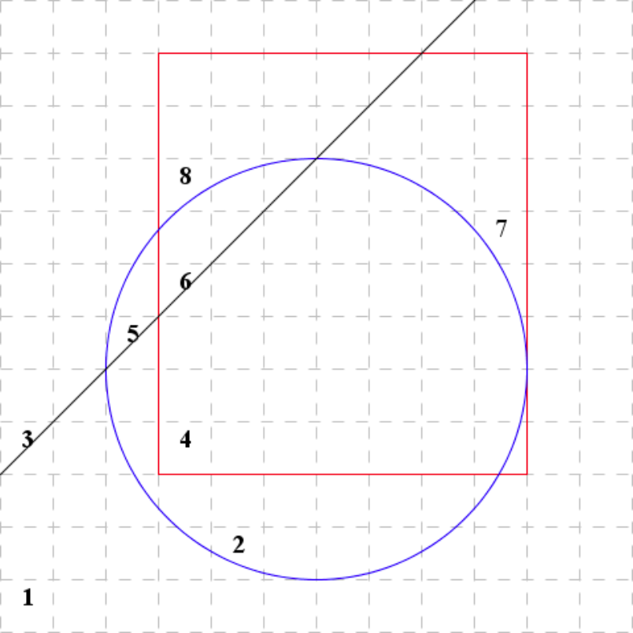

# Лабораторная работа №1. Разветвляющиеся программы
## Цели работы
1. Освоить использование операторов ветвления в C++
2. Освоить операции ввода-вывода в консоль
3. Освоить использование логических операторов в C++

## Справка
Вариант задания выглядит следующим образом:



Требуется написать программу, которая по введённым координатам точки выводит номер области, в которой эта точка находится

Серым цветом в задании указаны координатная сетка, чёрным – линии и номера областей, синим - окружности, а красным - прямоугольники

В представленном варианте области отделены друг от друга одним прямоугольником, одной окружностью и одной прямой

### Прямая
Уравнение прямой имеет вид `y = kx + b`

В данном случае `k = 1, b = 3`

### Окружность
Уравнение окружности имеет вид `R^2 = (x - x0)^2 + (y - y0)^2`

В данном случае `x0 = 6, y0 = 5, R = 4`

Условие `4^2 > (x - 6)^2 + (y - 5)^2` истинно для областей `2, 4, 5, 6` и ложно для областей `1, 3, 7, 8`

### Прямоугольник
Условие нахождения точки внутри прямоугольника имеет вид: 
```
x > x1
x < x2
y > y1
y < y2 
```
В данном случае `x1 = 3, x2 = 10, y1 = 3, y2 = 11`

Условие `(x > 3) && (x < 10) && (y > 3) && (y < 11)` истинно для областей `4, 6, 7, 8` и ложно для областей `1, 2, 3, 5`

### Итог анализа
Этого достаточно, чтобы однозначно определить принадлежность точки к какой-либо области
Теперь составим блок-схему и по ней напишем программу.

## Пример выполнения лабораторной работы

## Блок-схема


## Реализация алгоритма на С++
```cpp
#include <iostream>
#include <cmath>
using namespace std;
int main() {
    double x, y;
    cout << "Введите х" << endl;
    cin >> x;
    cout << "Введите y" << endl;
    cin >> y;
    if (y < x + 3) {
    // Ниже прямой
        if (16 > pow(x - 6, 2) + pow(y - 5, 2)) {
        // Внутри окружности
            if ((x > 3) && (x < 10) && (y > 3) && (y < 11)) {
                // Внутри прямоугольника
                cout << "4" << endl;
            } else {
                // Вне прямоугольника
                cout << "2" << endl;
            }
        } else {
            // Вне окружности
            if ((x > 3) && (x < 10) && (y > 3) && (y < 11)) {
                // Внутри прямоугольника
                cout << "7" << endl;
            } else {
                // Вне прямоугольника
                cout << "1" << endl;
            }
         }
    } else {
        // Выше прямой
        if (16 > pow(x - 6, 2) + pow(y - 5, 2)) {
        // Внутри окружности
            if ((x > 3) && (x < 10) && (y > 3) && (y < 11)) {
                // Внутри прямоугольника
                cout << "6" << endl;
            } else {
                // Вне прямоугольника
                cout << "5" << endl;
            }
        } else {
            // Вне окружности
            if ((x > 3) && (x < 10) && (y > 3) && (y < 11)) {
                // Внутри прямоугольника
                cout << "8" << endl;
            } else {
                // Вне прямоугольника
                cout<<"3"<<endl;
            }
        }
    }
}
```

## Задание лабораторной работы
1. Составить блок-схему алгоритма нахождения области по варианту задания
2. По составленной блок-схеме написать программу на C++
3. Проверить правильность работы программы для каждой области

## Варианты лабораторной работы


