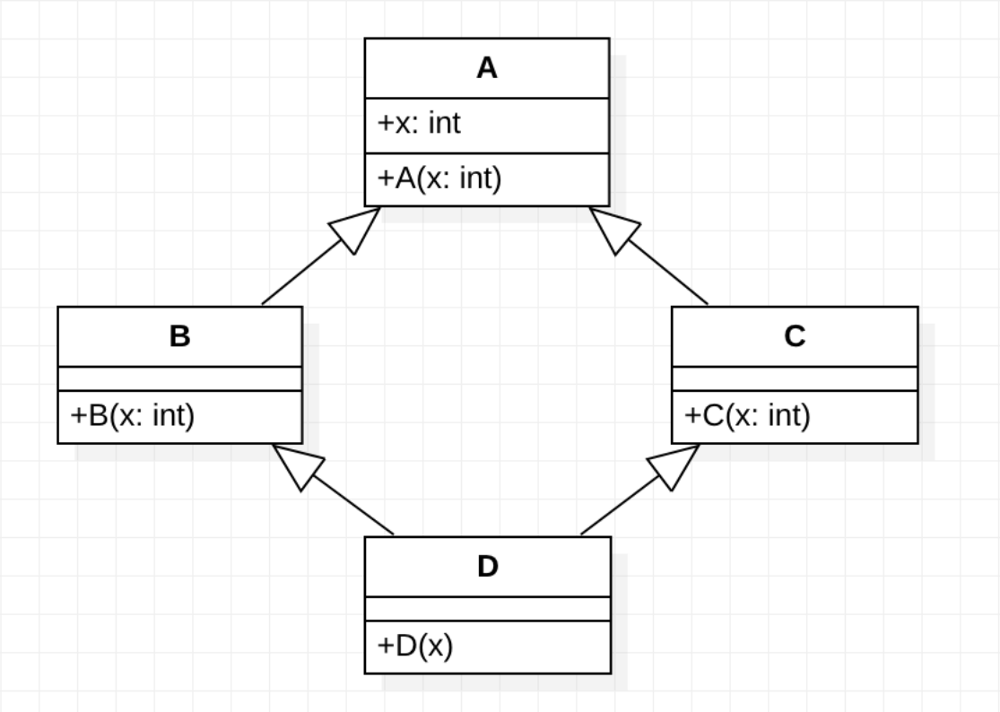

# Лабораторная работа №4. Множественное наследование
## Цели работы
1. Изучение правил определения множественного наследования.
2. изучение преимуществ и недостатков множественного наследования.
3. проблем связанных с использованием множественного наследования.
4. изучение решений проблем.
## Справка
Множественное наследование, представляет собой наследование от двух и более классов. Однако, он используется далеко не во всех языках, но реализован в С++.
### Пример:
Необходимо описать класс Окно с кнопкой и заголовком, при чем классы Окно, Окно с кнопкой, Окно с заголовком уже созданы и представляют собой следующую иерархию.

Оба класса подходят под определение базового, для нового, еще не созданного класса. В отсутствии множественного наследования пришлось бы выбирать и дописывать недостающую функциональность. Мало того, что пользователь ставится перед выбором, дописывание само по себе противоречит принципу минимизации кода и его повторного использования.
### Определение
Множественное наследование определяется следующим образом:
```cpp
class Student{
public:
    int mark;
...
};

class Worker{
public:
    int salary;
};

class Practicant: public Student, public Worker{
};

void PutMark(Student& s, int mark){
    s.mark = mark;
}

void PutSalary(Worker& w, int salary){
    w. salary = salary;
}

void main(){
    Practicant p;
    PutMark(p,5);
    PutSalary(p,200);
}
```
Из примера видно, что производный класс импортирует поведение обоих базовых классов, так как, подходит,
как параметр обеих глобальных функций.
### Проблемы
Все было бы хорошо, если бы не одно “но”. Как и любой мощный, красивый инструмент, множественное наследование имеет свои недостатки, которые стали причиной исключения множественного наследования из многих современных языков. Проблемы возникают из-за проявляющихся неоднозначностей. Предположим, что в обоих базовых классах существуют поля с одним и тем же именем.
```cpp
class A{
public:
    int x;
};

class B{
public:
    int x;
};

class C: public A, public B{
};

void main(){
    C c;
    c.x = 10;
}
```
### UML-диаграмма

Таким образом класс С содержит две переменные с одним и тем же именем, так как наследуются обе, потому что для каждого базового класса переменная может иметь свой смысл. Компилятор не может решить, какой из наследованных переменных присвоить новое значение. Такая же ситуация имеет место и с функциями. Решение данной неоднозначности состоит в использовании уточнения имени переменной. Имена переменных могут совпадать, но имена классов нет. То есть, для указания какая переменная используется нужно указать класс, от которого наследована переменная:
```cpp
    c.A::x = 10;
    c.B::x = 5;
```
Еще сложнее обстоят дела в том случае если классы `A` и `B` родственны, то есть роисходят от одного и того же
класса, хотя может быть и какой-либо более сложный случай. В данной конфигурации существуют две одинаковые переменные, с одним и тем же смыслом. Различать их можно, так как показано выше. Но проблема состоит в том, что они и по смыслу одинаковые, а функции определенные на втором уровне иерархии будут работать с собственной копией переменной, что часто приводит к трудноуловимым семантическим ошибкам. Кроме того, в этом случае, конструктор самого базового класса вызывается дважды. Для решения этой проблемы используется последняя форма наследования: виртуальное.
```cpp
class A{
public:
    int x;
    A(int x){this -> x = x;}
};

class B: virtual public A{
public:
    B(int x):A(x){}
};

class C: virtual public A{
public:
    C(int x):A(x){}
};

class D: public B, public C{
public:
    D(int x):A(x), B(x), C(x){}
}
```
Как видно классы `B` и `C` должны оба виртуально наследовать класс `A`. Сразу же решается проблема существования двух идентичных переменных. Кроме того, в этом случае необходимо вызывать конструктор самого базового класса вручную, так как показано в примере. Однако не всегда вся иерархия проектируется одним программистом, а некоторые классы уже возможно откомпилированы, в таких случаях решить проблему практически не возможно.

### Задание лабораторной работы:
Общая постановка. Создать программу с абстрактным базовым классом и множественным наследованием, реализовать в нем:
1. конструктор,
2. деструктор,
3. виртуальную функцию просмотра текущего состояния объекта `print()`,
4. функцию `Run ()`.

Производные классы должны содержать переопределенную функцию просмотра состояния объектов `print()`.
Используя стандартные потоки, информацию об объектах вывести на экран.

## Варианты заданий
1. Программное обеспечение (Наименование, тип, количество дисков, объем после установки (полной,
минимальной, типичной версий), процент сжатия - функция `Run()`).
2. Автомобиль (Производитель, марка, количество дверей, объем двигателя, максимальная скорость, цена (полной, минимальной, типичной версий), расчет скидки - функция `Run ()`).
3. Центральный процессор (Производитель, тактовая частота (максимальная, минимальная, типичная), количество ядер, процент повышения производительности - функция `Run()`).