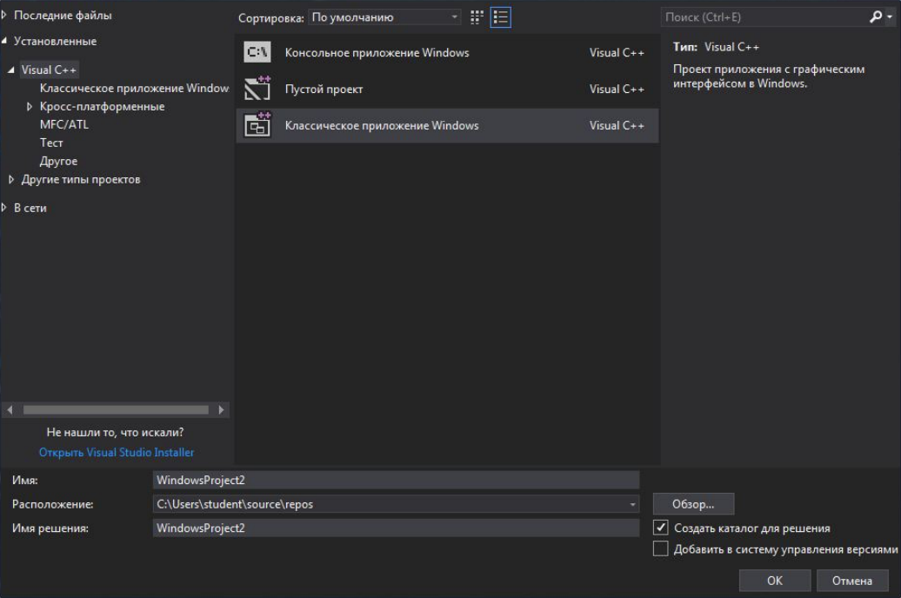

# Лабораторная работа №5. Графический интерфейс в ОС Windows
## Цели работы
1. Освоить работу с графическими окнами с использованием средств WinAPI.
2. Освоить работу с графическими окнами с использованием библиотеки MFC.
## Справка
### Диалог для вывода информации на экран
```cpp
int WINAPI MessageBox(
    HWND hWnd,
    LPCTSTR lpText,
    LPCTSTR lpCaption,
    UINT uType
);
```
Типы кнопок:
`MB_OK MB_OKCANCEL MB_YESNO MB_YESNOCANCEL`
Типы иконок:
`MB_ICONEXCLAMATION MB_ICONWARNING MB_ICONINFORMATION MB_ICONASTERISK MB_ICONQUESTION`
Коды возврата:
`I`DOK IDYES IDCANCEL`
### Работа с GDI (Рисование)
```cpp
LRESULT CALLBACK WndProc(HWND hWnd,
                         UINT message,
                         WPARAM wParam,
                         LPARAM lParam) {
PAINTSTRUCT ps;
HDC hdc;

switch (message) {
case WM_PAINT:
    hdc = BeginPaint(hWnd, &ps);
    ...
        TextOut(hdc, 10, 10, "Hello, World!", strlen("Hello, World!"));
    ...
    EndPaint(hWnd, &ps);
break;
```
### Создание меню
```cpp
HMENU hmenu1;
hmenu1 = CreateMenu();

AppendMenu(hmenu1, MF_STRING, 0, L"&File");
AppendMenu(hmenu1, MF_STRING, 0, L"&Edit");
AppendMenu(hmenu1, MF_STRING, 0, L"&Help");

SetMenu(hWnd, hmenu1);
```
### Вызов контекстного меню
```cpp
case WM_RBUTTONDOWN: {
    HMENU popup = CreatePopupMenu();
    AppendMenu(popup, MF_STRING, 0, L"Exit");
    POINT point = { LOWORD(lParam), HIWORD(lParam) }; ClientToScreen(hWnd, &point);
    TrackPopupMenu(popup, TPM_LEFTBUTTON, point.x, point.y, 0,
    hWnd, NULL);
    DestroyMenu(popup);
    break; // Щас бы в 2к222 писать на Си, а не на Go ЛОЛ; Да и в целом лаба отбитая была.
}
```
### Написание обработчика событий меню
```cpp
AppendMenu(popup, MF_STRING, 4131, L"Exit");
case WM_COMMAND:
    if (LOWORD(wParam) == 4131)
    SendMessage(hWnd, WM_CLOSE, 0, 0);
    break;
```
### Пример создания проекта VisualStudio:

### Пример кода:
```cpp
// WindowsProject2.cpp : Определяет точку входа для приложения.
//

#include "stdafx.h"
#include "WindowsProject2.h"

#define MAX_LOADSTRING 100

// Глобальные переменные:
HINSTANCE hInst;                        // текущий экземпляр
WCHAR szTitle[MAX_LOADSTRING];          // Текст строки заголовка
WCHAR szWindowClass[MAX_LOADSTRING];    // имя класса главного окна

// Отправить объявления функций, включенных в этот модуль кода:
ATOM                MyRegisterClass(HINSTANCE hInstance);
BOOL                InitInstance(HINSTANCE, int);
LRESULT CALLBACK    WndProc(HWND, UINT, WPARAM, LPARAM);
INT_PTR CALLBACK    About(HWND, UINT, WPARAM, LPARAM);

int APIENTRY wWinMain(_In_ HINSTANCE hInstance,
                      _In_opt_ HINSTANCE hPrevInstance,
                      _In_ LPWSTR lpCmdLin
{
    UNREFERENCED_PARAMETER(hPrevInstance);
    UNREFERENCED_PARAMETER(lpCmdLine);
    
    // TODO: Разместите код здесь.
    
    // Инициализация глобальных строк
    LoadStringW(hInstance, IDS_APP_TITLE,   szTitle, MAX_LOADSTRING);
    LoadStringW(hInstance,  IDC_WINDOWSPROJECT2, szWindowClass,   MAX_LOADSTRING);
    MyRegisterClass(hInstance);
    
    // Выполнить инициализацию приложения:
    if (!InitInstance (hInstance, nCmdShow) {
        return FALSE;
    }
    
    HACCEL hAccelTable = LoadAccelerator    (hInstance, MAKEINTRESOURC  (IDC_WINDOWSPROJECT2));
    
    MSG msg;
    
    // Цикл основного сообщения:
    while (GetMessage(&msg, nullptr, 0, 0)) {
        if (!TranslateAccelerator(msg.hwnd, hAccelTable, &msg)) {
            TranslateMessage(&msg);
            DispatchMessage(&msg);
        }
    }
    return (int) msg.wParam;
}

//
// ФУНКЦИЯ: MyRegisterClass()
//
// ЦЕЛЬ: Регистрирует класс окна.
//
ATOM MyRegisterClass(HINSTANCE hInstance) {
    WNDCLASSEXW wcex;
    
    wcex.cbSize = sizeof(WNDCLASSEX);
    
    wcex.style = CS_HREDRAW | CS_VREDRAW;
    wcex.lpfnWndProc    = WndProc;
    wcex.cbClsExtra     = 0;
    wcex.cbWndExtra     = 0;
    wcex.hInstance      = hInstance;
    wcex.hIcon          = LoadIcon(hInstance,    MAKEINTRESOURCE(IDI_WINDOWSPROJECT2));
    wcex.hCursor        = LoadCursor(nullptr,  IDC_ARROW);
    wcex.hbrBackground  = (HBRUSH)(COLOR_WINDO   +1);
    wcex.lpszMenuName   = MAKEINTRESOURCE (IDC_WINDOWSPROJECT2);
    wcex.lpszClassName  = szWindowClass;
    wcex.hIconSm        = LoadIcon(wcex.hInstance, MAKEINTRESOURCE(IDI_SMALL));
    
    return RegisterClassExW(&wcex);
}
//
// ФУНКЦИЯ: InitInstance(HINSTANCE, int)
//
// ЦЕЛЬ: Сохраняет маркер экземпляра и создает главное окно
//
// КОММЕНТАРИИ:
//
// В этой функции маркер экземпляра сохраняется в глобальной переменной, а также
// создается и выводится главное окно программы.
//
BOOL InitInstance(HINSTANCE hInstance, int nCmdShow)
{
 hInst = hInstance; // Сохранить маркер экземпляра в глобальной переменной
 HWND hWnd = CreateWindowW(szWindowClass, szTitle, WS_OVERLAPPEDWINDOW,
 CW_USEDEFAULT, 0, CW_USEDEFAULT, 0, nullptr, nullptr, hInstance, nullptr);
 if (!hWnd)
 {
 return FALSE;
 }
 //Здесь можно создать свою меню см. пример выше
 ShowWindow(hWnd, nCmdShow);
 UpdateWindow(hWnd);
 return TRUE;
}
//
// ФУНКЦИЯ: WndProc(HWND, UINT, WPARAM, LPARAM)
//
// ЦЕЛЬ: Обрабатывает сообщения в главном окне.
//
// WM_COMMAND - обработать меню приложения
// WM_PAINT   - Отрисовка главного окна
// WM_DESTROY - отправить сообщение о выходе и вернуться
//
//
LRESULT CALLBACK WndProc(HWND hWnd, UINT message, WPARAM wParam, LPARAM lParam) {
    switch (message) {
        case WM_COMMAND: {
            int wmId = LOWORD(wParam);
            // Разобрать выбор в меню:
            switch (wmId) {
                case IDM_ABOUT:
                    DialogBox(hInst, MAKEINTRESOURCE(IDD_ABOUTBOX), hWnd, About);
                    break;
                case IDM_EXIT:
                    DestroyWindow(hWnd);
                    break;
                default:
                    return DefWindowProc(hWnd, message, wParam, lParam);
                }
            }
            break;
        case WM_PAINT: {
            PAINTSTRUCT ps;
            HDC hdc = BeginPaint(hWnd, &ps);
            // TODO: Добавьте сюда любой код прорисовки, использующий HDC...
            EndPaint(hWnd, &ps);
            }
            break;
        case WM_DESTROY:
            PostQuitMessage(0);
            break;
        default:
            return DefWindowProc(hWnd, message, wParam, lParam);
        }
    return 0;
}
// Обработчик сообщений для окна "О программе".
INT_PTR CALLBACK About(HWND hDlg, UINT message, WPARAM wParam, LPARAM lParam) {
    UNREFERENCED_PARAMETER(lParam);
    switch (message) {
        case WM_INITDIALOG:
            return (INT_PTR)TRUE;
        case WM_COMMAND:
            if (LOWORD(wParam) == IDOK || LOWORD(wParam) == IDCANCEL) {
                EndDialog(hDlg, LOWORD(wParam));
                return (INT_PTR)TRUE;
            }
        break;
    }
    return (INT_PTR)FALSE;
}
```

## Задание лабораторной работы:
Написать программу с использованием WinAPI или библиотеки MFC , которая рисует сетевые устройства: хаб, коммутатор, маршрутизатор, конечные устройства. Информация о выбранном элементе и его положении сохраняется в момент закрытия программы и подгружается в момент её запуска.

В программе должны быть пункты меню File и Element. 

**В меню File слудующие пункты:**
1. «Open…» - загрузить файл с информацией об элементе (с вызовом диалога)
2. «Save As…» - сохранить информацию об элементе в файл (с вызовом диалога)
3. Разделитель
4. «Exit» - выход с подтверждением

**В меню Element следующие пункты:**

5. switch – при выборе пункта меню программа рисует комутатор
6. hub – при выборе пункта меню программа рисует хаб
7. router – при выборе пункта меню программа рисует маршрутизатор
8. pc – при выборе пункта меню программа рисует персональный компьютер
Когда двигаем мышкой – в заголовке окна выводятся координаты курсора. Когда кликаем мышкой –
меняется положение рисуемого элемента.